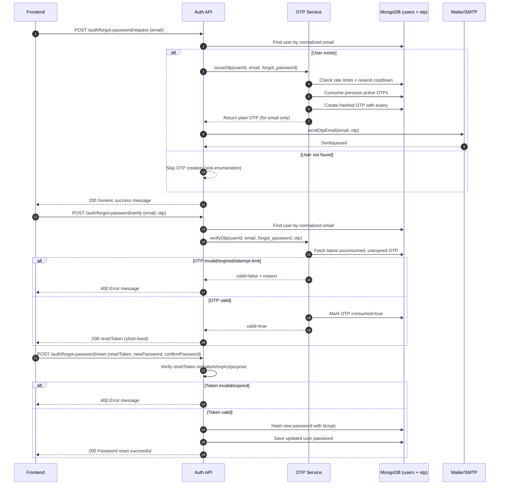
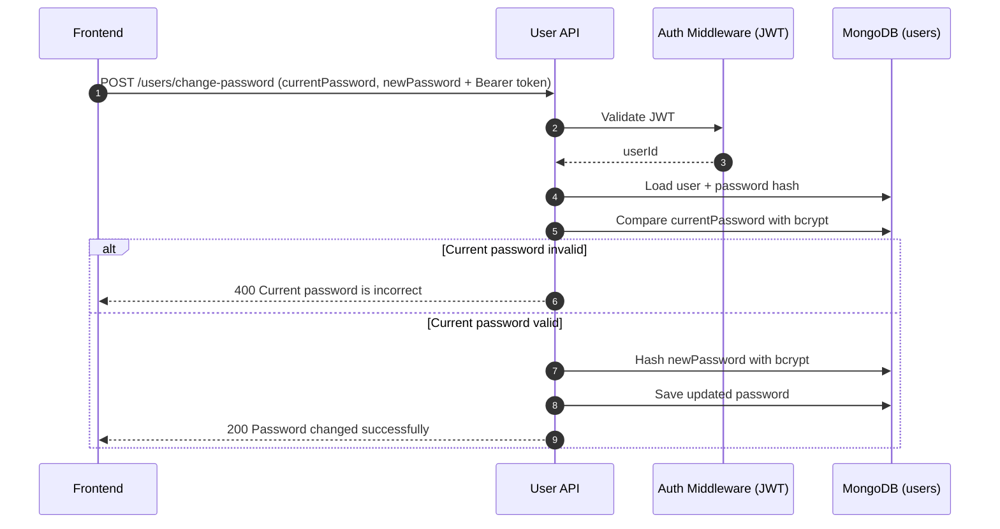

# OTP Flow Documentation

## Overview
This document explains the OTP lifecycle used for:
- Forgot password reset (public flow)
- Change password (authenticated flow)
- Profile update OTP (same OTP engine, different purpose)

Core implementation files:
- `utils/otp.service.js`
- `models/otp.model.js`
- `utils/mailer.js`
- `controllers/authcontroller.js`
- `controllers/user.controller.js`

---

## OTP Engine (Shared)

`issueOtp({ userId, email, purpose })`:
- Normalizes email (`trim().toLowerCase()`)
- Enforces request window limit (`OTP_MAX_REQUESTS_PER_WINDOW`, default 3 in 15 minutes)
- Enforces resend cooldown (`OTP_MIN_RESEND_SECONDS`, default 60s)
- Consumes older active OTPs for same scope/purpose
- Generates a 6-digit OTP and stores only SHA-256 hash (`otpHash`)
- Sets expiry (`OTP_EXPIRY_MINUTES`, default 10)

`verifyOtp({ userId, email, purpose, otp })`:
- Finds latest unconsumed, unexpired OTP for matching purpose/scope
- Increments attempts on invalid OTP
- Locks OTP when max attempts reached (`maxAttempts`, default 5)
- Marks OTP consumed on success

Mongo indexes in `otp.model.js`:
- TTL index on `expiresAt` for automatic cleanup
- Query indexes for `{ userId/email, purpose, consumed, createdAt }`

---

## 1) Forgot Password Sequence

### Endpoints
- `POST /api/v1/auth/forgot-password/request`
- `POST /api/v1/auth/forgot-password/verify`
- `POST /api/v1/auth/forgot-password/reset`

### Frontend Visibility
- API response is immediate.
- Email arrival is asynchronous and can be delayed by SMTP provider.
- Generic success message on request prevents account enumeration.

---

## 2) Change Password (Authenticated) Sequence

### Endpoints
- `POST /api/v1/users/change-password`

---

## Validation Rules Used
Defined in `validators/validation.rules.js`:
- `forgotPasswordRequestRules`
- `forgotPasswordVerifyRules`
- `forgotPasswordResetRules`
- `changePasswordRules`

OTP input constraints:
- Required
- Exactly 6 digits
- Numeric only

---

## Common Error Responses (Frontend Mapping)
- `400`: invalid input, invalid OTP, expired OTP, current password mismatch
- `429`: OTP rate limit/cooldown reached
- `500`: unexpected server/email error

Recommended frontend behavior:
- Show success toast immediately when request endpoint returns `200`.
- Start resend countdown timer.
- Display API message body for `400`/`429`.
- Allow retry path when email delivery is delayed.
